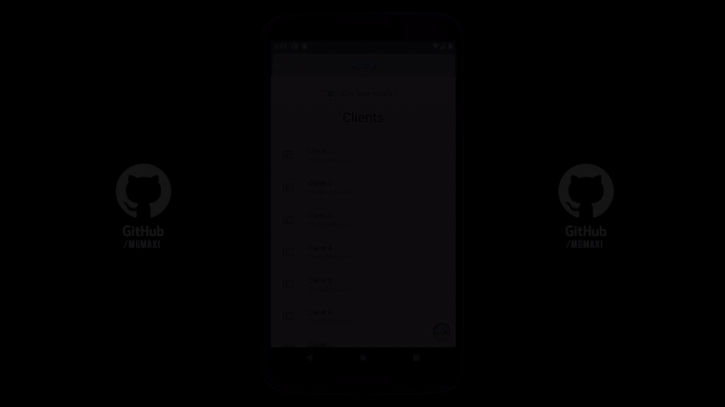

# <b> CRUD Client Manager</b>

This is a project from the specialization program on mobile development of IBM & CaC.

## 📖 <b> About </b>

crudClientManager is a project in which you can create, read, update and delete clients from a Data Base made it with [API: JSON Server](https://github.com/typicode/json-server).

## 🛠️ <b> Technologies </b>

- [React Native](https://reactnative.dev)
- [React Navigation](https://reactnavigation.org/)
- [React Native Paper](https://callstack.github.io/react-native-paper/)
- [Axios](https://axios-http.com/)
- [API: JSON Server](https://github.com/typicode/json-server)

## 📷 <b> Preview </b>



## 🚀 <b> Setup / Launch</b>

### 🔧 <b>Local Installation</b>

```
git clone https://github.com/mgmaxi/crudClientManager
cd ./crudClientManager
npm install
```

### ⚙️ <b>Run it</b>

```
Run JSON Server:
- json-server --watch db.json

Run App:
- Android: "npx react-native run-android"
- IOS: "npx react-native run-ios"
```
